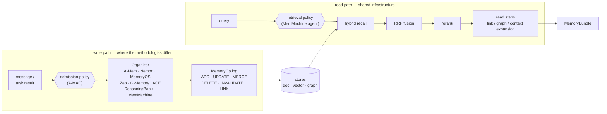

# agmem — agentic memory, reimplemented with its lineage attached

Nine agentic-memory methodologies — **A-Mem · Nemori · Mem0 · MemoryOS · Zep/Graphiti · G-Memory · ACE · ReasoningBank · MemMachine** — reimplemented behind one API, where *which version of the method you are running* is a first-class, pinnable, testable property.

[](https://github.com/jinmang2/agentic-memory/actions/workflows/ci.yml)
[](LICENSE)
[](pyproject.toml)

---

## The problem this repo is built around

Reimplementing a memory paper sounds like a transcription task. It isn't, because **the paper and the official code routinely describe different systems** — and a benchmark number is meaningless if you cannot say which of the two you measured.

Every row below was found by reading the paper against the official repository, and each was independently re-verified (by code-line citation, or by a deterministic reproduction) before being acted on:

| Methodology | What the paper (or the label) says | What the official code does |
|---|---|---|
| **MemoryOS** | segments with the lowest *heat* are evicted (§3.3) | both codebases call `evict_lfu` — a min over an access counter. Lowest-heat eviction exists in neither. |
| **A-Mem** | notes carry LLM-extracted keywords / context / tags | in the published-numbers edition the extractor raises `NameError` (no `import re`), so every note stores **empty** metadata — after spending the LLM call |
| **G-Memory** | link tasks at `similarity >= 0.7` | 0.7 is applied to `1 − squared_L2` on normalized vectors — an effective **cosine of 0.85** |
| **Nemori** | merge candidates are filtered at 0.85 | the threshold is plumbed from config into a field **no code reads**; all top-5 candidates reach the LLM |
| **Zep/Graphiti** | the paper's extraction/temporal pipeline | main has moved *past* its own paper: saga nodes, single-call combined extraction, `temporal_operations.py` dissolved |
| **A-MAC** | θ\* = 0.55 with five weighted features | the weight vector appears only in the release, fit while novelty was pinned at 1.0 and recency ≈ 0 |
| **MemMachine** | an eval harness that produced the published numbers | at the audited SHA every eval entry point raises `TypeError` before it runs |

This is **not a criticism of those projects** — it is the ordinary condition of research code, and all nine are serious pieces of work. It is, however, fatal to the naive goal of "being faithful to the paper," because that target does not exist as a single point.

**You do not have to take that table on trust.** Six scripts re-derive those rows on your own machine, against the exact upstream commits each defect was found at — **no model call, no API key, $0**, about 25 seconds:

```bash
uv sync --no-default-groups --group dev
cd scripts/repro/defects
uv run --no-default-groups --group dev python run_all.py --fetch   # --fetch pulls the pinned snapshots
```

```
6 passed, 0 skipped, 0 failed — 14 claims re-proved in 23.4s, $0 spent.

VERDICT: all 6 reproductions held.
```

Each line of output is printed by the script that proved it. A script whose evidence is missing prints `SKIP` and proves nothing, and a run where *nothing* was proved exits non-zero — a broken setup must not be able to look like a clean bill of health. CI runs these same scripts on every push, against the same pins, from the same fetch script. Full output and what each one proves: [docs/demos/reproduce-defects.md](docs/demos/reproduce-defects.md).

**The stance this repo takes instead: pin the lineage.** Every divergent constant names the lineage it came from, and the choice is an explicit, switchable, tested object:

```python
NemoriOrganizer(fidelity="v1")        # the v1 paper's formalism
NemoriOrganizer(fidelity="v4")        # the current paper
NemoriOrganizer(fidelity="upstream")  # what the deployed code actually does
MemoryOSOrganizer(fidelity="eval")    # the harness that produced the paper's LoCoMo numbers
```

A run can therefore state *which system it measured*, and a reviewer can check that claim against the preset table rather than against prose.

---

## Design



Policies (rounded) own no memory type and emit no ops, so they wrap any host mechanism. Everything an organizer does reaches the stores as a `MemoryOp`; nothing writes through a side channel.

**One write-path abstraction.** Every memory mutation is an append-only `MemoryOp` — `ADD / UPDATE / MERGE / DELETE / INVALIDATE / LINK`. ACE's delta operations, G-Memory's rule ops and Zep's bi-temporal invalidation all project onto it. Two things fall out for free: Zep's bi-temporal T′ axis (the store stamps it), and the structural impossibility of a whole class of in-place mutation bugs the upstreams carry.

**Methodologies are write-path plugins.** Retrieval is shared infrastructure (hybrid recall → RRF → rerank → read steps); what actually differs between these papers is how experience becomes memory. An `Organizer` implements a small hook contract (`on_message`, `on_task_end`, `on_retrieval`, `on_feedback`, `consolidate`, …) and declares what it `produces`/`consumes`, so organizers can be chained — Nemori emitting episodes that MemoryOS then consumes is a supported composition, not a fork.

**Mechanism vs. policy.** Some published contributions are not memory systems but *controls over* one: A-MAC's admission gate (write side) and MemMachine's retrieval agent (read side). They own no memory type and emit no ops, so they wrap any host mechanism instead of being welded into one.

**Capability gating.** Neo4j, Kuzu, LanceDB, Qdrant, Chroma, Postgres, cross-encoder rerankers and local LLMs are all implemented, then selected or downgraded from detected hardware — the heavy path is never a hard requirement. CI proves it: the suite runs green on a **core-only install** with every optional path skipping cleanly.

---

## How the claims here were checked

The interesting engineering in this repo is not that nine systems were written; it is that they were *audited*, repeatedly, against their sources.

- **A dozen audit rounds**, recorded in `docs/10-fidelity-audit.md` and `docs/research/fidelity-*.md`.
- The final round ran **eight parallel fresh-eyes audits** that read the upstream clones directly and treated this repo's own documentation as *claims to be verified*, not evidence — because those docs came from the same eyes that would have made any original mistake.
- Findings then went through an **adversarial verification pass** whose job was to *refute* them, using **zero LLM/API/model calls**: code-line citation, and deterministic reproductions with hand-made vectors and stubs.
- **96 verdicts: 94 confirmed, 2 sub-claims refuted** — and the refutations were honored in the fixes.
- Everything confirmed was either fixed to match upstream or kept and **disclosed as a deliberate deviation at the code site** (e.g. we skip an evolution call the published A-Mem edition wastes on an empty store — so our per-conversation call count is exactly −1, and the docstring says so).
- **822 tests** (measured 2026-08-19, `uv run pytest -q`: 822 passed, 1 skipped), many of them pinning tests written specifically so a fidelity property cannot silently regress.

Recurring defect classes this process surfaced — useful beyond this repo — are catalogued in `docs/16-abstraction-study.md`: *the same constant applied to different math*, *reviving a knob that is dead upstream*, *reading one variant when the benchmark ran another*, and *a docstring that outlived its code*.

---

## Status, honestly

**Measurement is deliberately deferred.** No benchmark result is claimed on this page.

LoCoMo and LongMemEval harnesses are implemented, and reproduction artifacts are committed under `results/` (see `docs/14-amem-reproduction.md` and the portable runbook in `docs/15-repro-portable-runbook.md`). The fidelity fixes from the latest audit round changed write-path behavior in seven of the methodologies, which invalidated the pre-audit numbers; **five write paths have since been re-measured post-fix on the full LoCoMo 10-conversation set under one harness and one judge — A-Mem, Nemori (both arms of the ledger's B-3 pair), Mem0 and Zep — and are tabulated in [`docs/18-locomo-4way.md`](docs/18-locomo-4way.md).** The remaining five methodologies have no post-fix **conversational (LoCoMo)** number — two of them, ACE and ReasoningBank, do carry measured FiNER numbers in [`docs/19-ace-finer.md`](docs/19-ace-finer.md). LongMemEval has since been measured on the **reading side** (2026-08, [`docs/20-lme-reading.md`](docs/20-lme-reading.md)): oracle, retrieval and context arms over the full 500 questions, holding the memory constant and moving only what the answerer reads. What has **never** been run on LongMemEval is an organizer (memory-system) arm — that hole is known, priced, and deliberately still open. (Ledger C-4 is about the benchmark's own traps — two unequal official "accuracies" and a `has_answer` label that leaks the answer — not about run status.) The working rule in this project is that a number produced by a mislabeled lineage is worse than no number, so the wiring gets verified first and an unmeasured row stays visibly empty.

---

## Quickstart

```bash
uv sync                     # full install (real vector/graph backends + local embedder)
uv sync --no-default-groups --group dev   # core-only: suite still runs, heavy paths skip

uv run pytest tests/ -q     # 822 passed, 1 skipped (2026-08-19; core-only figures date from 2026-08-08: 687 passed, 24 skipped)
```

```python
from agmem import AgenticMemory

mem = AgenticMemory(organizers=["nemori", "reasoning_bank"])
mem.add_message("The Paris trip budget is 3,000,000 KRW")
print(mem.search("travel budget").render(400))
```

Serve it over MCP (registration details in `docs/05-api-design.md` §2.3):

```bash
uv run agmem-mcp --organizers nemori,reasoning_bank   # namespace: $AGMEM_NAMESPACE or "main"
```

MCP exposes memory as *tools*, which the model has to decide to call. The hooks
in `src/agmem/hooks/` fire whether or not anyone decided anything — `recall` on
`SessionStart` (recency, reads the doc store only), `recall_prompt` on
`UserPromptSubmit` (the prompt as the query, top-5 injected) and `capture` on
`UserPromptSubmit` (`async`). None of them loads a model: they talk to the
same `agmem-mcp --transport http` process over loopback, which the first hook
of a session starts and which exits when idle (`docs/05-api-design.md` §2.3.1).
Wiring is §2.4. Both layers resolve *which* store through the same
three variables (`AGMEM_NAMESPACE`, `AGMEM_DATA_DIR`, `AGMEM_CONFIG`) with the
same defaults, and every MCP tool takes an optional `namespace` so one server
can keep projects apart. That they really share one store — a prompt the hook
captured comes back from the server's `search_memory`, with neither side told
the namespace — is checked end to end by:

```bash
uv run python scripts/smoke_product_stack.py            # in-process path
uv run python scripts/smoke_product_stack.py --daemon   # + spawn, backfill, recall_prompt
```

Run a reproduction experiment (needs an LLM endpoint — see `docs/07-local-llm-setup.md`):

```bash
uv run python scripts/exp_locomo_conv0.py --configs passthrough amem nemori memoryos
```

---

## Repository map

```
src/agmem/
  core/          MemoryOp, Episode, MemoryBundle — the facade's vocabulary
  organizers/    one package per methodology (+ presets/recipes that pin lineage)
  policies/      admission (A-MAC) and retrieval (MemMachine agent) — host-agnostic controls
  retrieval/     hybrid recall, RRF fusion, rerankers, read steps, BFS graph expansion
  stores/        sqlite/lance/qdrant/chroma · kuzu/neo4j · postgres, behind one contract
  capabilities/  hardware detection and profile resolution (lite · standard · full)
  bench/         LoCoMo and LongMemEval harnesses
  mcp/           MCP server
  hooks/         Claude Code SessionStart recall and UserPromptSubmit capture
docs/            design record (00–20) + docs/research/ paper↔code forensics + docs/demos/
tests/           822 tests, incl. fidelity pinning suites
```

## Documentation

| Doc | What's in it |
|---|---|
| [docs/demos/](docs/demos/) | short pages that show one thing each and cost $0 to check: the defect reproductions above, and where an ACE run's money actually went |
| [docs/17-defect-ledger.md](docs/17-defect-ledger.md) | the defect ledger: what the source papers' own code does, in three tiers, every claim with a proof |
| [docs/18-locomo-4way.md](docs/18-locomo-4way.md) | the conversational five-way on LoCoMo: one harness, one judge, five write paths, with the footnotes that must travel with it (filename keeps `4way` so existing links resolve) |
| [docs/19-ace-finer.md](docs/19-ace-finer.md) | ACE's self-evolving playbook on FiNER, measured against not having one — and why the control arm is half the finding |
| [docs/20-lme-reading.md](docs/20-lme-reading.md) | LongMemEval with the memory held constant: oracle, retrieval and context arms that move only the reading — and the organizer arm that is priced but deliberately not run |
| [docs/21-lme-findings.md](docs/21-lme-findings.md) | the LongMemEval findings arranged for presentation: what the benchmark actually ranks, every number sourced to docs/20, and the never-run organizer arm stated up front (Korean) |
| [docs/02-survey-comparison.md](docs/02-survey-comparison.md) | survey of the systems: mechanisms, benchmarks, reproducibility |
| [docs/04-architecture.md](docs/04-architecture.md) | module structure, organizer contract, chaining |
| [docs/05-api-design.md](docs/05-api-design.md) | Python API, MCP tools, bench CLI |
| [docs/01-capability-system.md](docs/01-capability-system.md) | capability detection and profiles |
| [docs/16-abstraction-study.md](docs/16-abstraction-study.md) | three-way study: paper ↔ upstream ↔ this code, and the abstraction verdict |
| [docs/research/fidelity-round12-fresh-eyes-reaudit.md](docs/research/fidelity-round12-fresh-eyes-reaudit.md) | the latest audit round, its adversarial verification, and the fix record |
| [docs/15-repro-portable-runbook.md](docs/15-repro-portable-runbook.md) | reproduction runbook |
| [docs/12-code-conventions.md](docs/12-code-conventions.md) | code conventions used as the review gate |

Design documents are written in Korean; code, comments and this page are in English.

## License

[Apache-2.0](LICENSE). The reimplementations here are original code written from the papers and the public repositories of each methodology; those upstream projects retain their own licenses and are credited in the per-organizer module docstrings.
