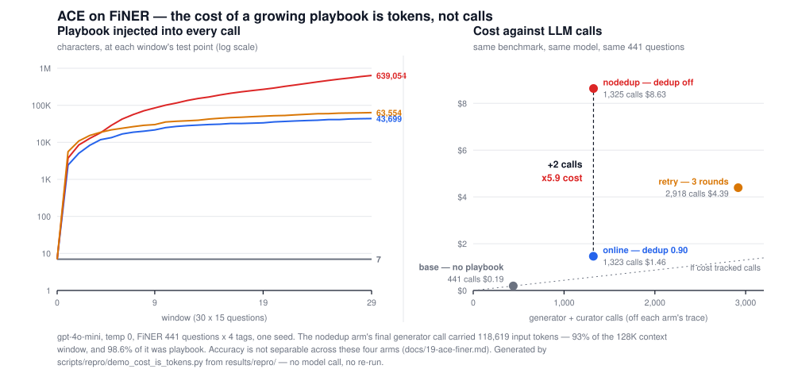

# Demo C — cost is tokens, not calls

> Runs in under a second, spends **$0**, makes **no model call**. Everything below is read out of
> artifacts already in `results/repro/`.
>
> ```
> uv run python scripts/repro/demo_cost_is_tokens.py
> ```



## The two numbers a reader will assume are typos

**Turning one boolean off multiplied the bill by 5.9× and moved the call count by 2.** The `online`
arm ran ACE's curator with our 0.90-cosine dedup gate; `nodedup` ran it at upstream's shipped
default, which is no gate at all. 1,323 calls → 1,325 calls. $1.461 → $8.633.

**The nodedup arm's final generator call carried 118,619 input tokens — 93% of `gpt-4o-mini`'s 128 K
context window — around a task whose own prompt averages 1,951 tokens.** That is 61× the task, and
it is the same task: the playbook is injected whole into every generator and curator call, so it
rides along 639,054 characters at a time — measured on that arm's final generator prompt, **98.6% of
everything the model was handed** (639,054 of 648,064 characters).

**Any cost model for a self-evolving playbook that counts requests is wrong here by more than an
order of magnitude.**

## The four arms

Condition for every row: FiNER shipped test split, 441 questions × 4 US-GAAP tags, `gpt-4o-mini` at
temperature 0 as both generator and curator, `text-embedding-3-small`, ACE's online mode over 30
windows of 15, **one seed**.

| arm | tag accuracy | LLM calls | cost | playbook chars, final window | final generator call, tokens in |
|---|---|---|---|---|---|
| `base` | 48.24 | 441 | $0.192 | 7 | 1,921 |
| `online` | 46.71 | 1,323 | $1.461 | 43,699 | 9,799 |
| `nodedup` | 48.98 | 1,325 | $8.633 | 639,054 | 118,619 |
| `retry` | 45.80 | 2,918 | $4.394 | 63,554 | 13,972 |

The last column is one measured call, not an average, because `nodedup` and `retry` were resumed
after the host killed them and the tail of a resumed trace straddles two processes. For the record,
`nodedup`'s last fifteen generator calls average 113,911 tokens — 9 from the killed process and 6
from the one that finished, all carrying a fully grown playbook.

**The accuracy column is the reason this is a cost demo and not a win.** None of the three learning
arms separates from `base` — the arm that carries no playbook at all — in a paired bootstrap over
the same questions. The most expensive arm against the reference: `nodedup − base` = +0.91 pp on
sample accuracy, 95% CI [-2.04, +3.86], p = 0.607, over 10,000 resamples at seed 0. The spending in
the cost column bought nothing measurable. Full treatment, including what the playbook did contain
and why the retry arm makes things worse: [docs/19-ace-finer.md](../19-ace-finer.md).

## Where each number comes from

| number | artifact | field |
|---|---|---|
| playbook chars per window | `results/repro/gpt-4o-mini_ace_finer_{arm}.json` | `per_window[].playbook_chars_at_test` |
| cost and calls per arm | `results/repro/finer_paired.json` | `cost_usd`, `llm_calls` |
| tag accuracy per arm | `results/repro/finer_paired.json` | `anchors[arm].tag_accuracy` |
| generator tokens per call | `results/repro/gpt-4o-mini_ace_finer_{arm}.llm-trace.jsonl` | `tokens_in` on `generate` rows |
| base arm's task-prompt size | `results/repro/gpt-4o-mini_ace_finer_base.json` | `llm_budget.generate.tokens_in / calls` |

**Two things the artifacts will not let you do.** The traces append across processes, so
`nodedup.llm-trace.jsonl` holds 447 generate rows for a 441-question arm — the 6 extras are calls
from an attempt the host killed. They were billed, so they count toward cost, and they must not be
used to rebuild a per-window curve; that curve comes from the summaries. And the summaries'
`llm_budget` counts only the last process of a resumed arm (164 calls of 1,325 for `nodedup`) while
also counting the embedder calls the trace does not — it is used here for the base arm alone, which
ran in one process and embedded nothing.
