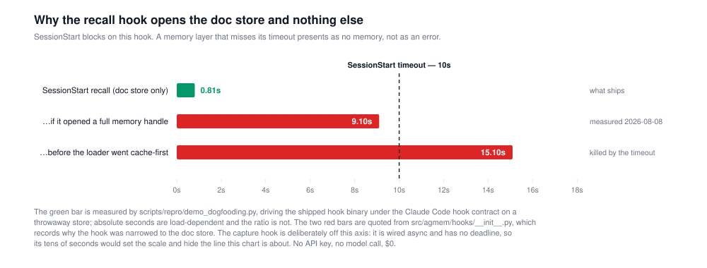

# Demo B — the memory layer, running inside the tool that needed it

Every session of this project used to open the same way: the model knew nothing, so its first
minutes went to rediscovering where the work had stopped. That is the problem this repository is
built around, and this page runs the fix against itself.

**No API key, no model call, $0.** Capture is deliberately organizer-free — `hooks.open_memory`
passes `organizers=[]`, so nothing reaches a paid endpoint on somebody's keystroke. The only model
involved is a local sentence-transformer producing embeddings.

```
uv run python scripts/repro/demo_dogfooding.py
```



## What was run

The hooks are subprocesses invoked under the Claude Code hook contract — a JSON event on stdin, a
JSON object on stdout — which is exactly how the harness invokes them. Nothing is stubbed. The store
is a throwaway temp directory, never `~/.agmem/data`: a demo must not write into the reader's real
memory, and reading from ours would make the output depend on a machine nobody else has.

**Act one — a session that learns things.** 6 prompts through the real `UserPromptSubmit` hook:

1. The ACE nodedup arm on FiNER cost $8.63 against the online arm's $1.46, and the LLM call count moved by two: 1,323 to 1,325.
2. That means the cost of a self-evolving playbook is carried in tokens, not in requests — the playbook is injected whole into every generator and curator call.
3. None of the three ACE learning arms separates from the base arm that never learned. The null survived turning our dedup gate off, which was the last explanation for it.
4. Track 6 is the demo track. Agreed order is C, D, then B, then A; C and D spend nothing.
5. The LongMemEval claim-C lane is finished at $3.77. The only remaining spend decision there is the _s extension at about $21, which is not approved.
6. Rule for this repo: never restate a measured number without its condition — the arm, the model, the read path. Every headline in the campaign has at least one.

These are statements about this project's own campaign, with sources — `docs/19-ace-finer.md` for
the ACE arms, the demo plan for the track order. They are not a captured transcript, because a real
transcript cannot be published and a synthetic one presented as real would be exactly the kind of
claim this repository exists to argue against. What is measured is the mechanism and its latency;
what is staged is the content.

**Act two — the session ends. A new one starts.** The `SessionStart` hook fires and this is the
block it hands the model, verbatim from `hookSpecificOutput.additionalContext`:

```
Recent memory from previous sessions (agmem, most recent first). This is a recency listing, not a relevance search — no query existed yet at session start. Treat it as a reminder of what was going on, and search memory explicitly when you need an answer.
- (2026-08-17) Rule for this repo: never restate a measured number without its condition — the arm, the model, the read path. Every headline in the campaign has at least one.
- (2026-08-17) The LongMemEval claim-C lane is finished at $3.77. The only remaining spend decision there is the _s extension at about $21, which is not approved.
- (2026-08-17) Track 6 is the demo track. Agreed order is C, D, then B, then A; C and D spend nothing.
- (2026-08-17) None of the three ACE learning arms separates from the base arm that never learned. The null survived turning our dedup gate off, which was the last explanation for it.
- (2026-08-17) That means the cost of a self-evolving playbook is carried in tokens, not in requests — the playbook is injected whole into every generator and curator call.
- (2026-08-17) The ACE nodedup arm on FiNER cost $8.63 against the online arm's $1.46, and the LLM call count moved by two: 1,323 to 1,325.
```

**Act three — the other layer, and what it does not prove here.** The recall block is a *recency
listing*; it says so itself, in its own header, because a model told "here is what you remember"
will trust it more than a recency dump deserves. Anything better has to be *asked for*, which is
what the MCP server is: the same store, exposed as 6 tools the model can call. Asking it

> What did we conclude about where the money goes in a self-evolving playbook?

returns, in served order:

| rank | score | text |
|---|---|---|
| 1 | 0.0164 | That means the cost of a self-evolving playbook is carried in tokens, not in requests — the playbook is inject |
| 2 | 0.0159 | Track 6 is the demo track. Agreed order is C, D, then B, then A; C and D spend nothing. |
| 3 | 0.0158 | The LongMemEval claim-C lane is finished at $3.77. The only remaining spend decision there is the _s extension |
| 4 | 0.0157 | Rule for this repo: never restate a measured number without its condition — the arm, the model, the read path. |
| 5 | 0.0156 | None of the three ACE learning arms separates from the base arm that never learned. The null survived turning  |
| 6 | 0.0152 | The ACE nodedup arm on FiNER cost $8.63 against the online arm's $1.46, and the LLM call count moved by two: 1 |

**Read that ranking honestly: it is flat, and it is the whole store.** 6 episodes went in and 6 came
back, spread over 0.0012 of score. At this size the vector path cannot be shown to beat the recency
dump, because there is nothing for it to leave out. Nobody should read this section as evidence that
retrieval works; the LoCoMo and LongMemEval measurements are where that question is answered, with
intervals — [`docs/18-locomo-4way.md`](../18-locomo-4way.md) and
[`docs/20-lme-reading.md`](../20-lme-reading.md).

What this section *does* establish is the seam, and it is the one thing neither layer's own tests
cover: **an episode a hook wrote on a keystroke came back out of a separately-launched server
process, over the vector path, in a different session.** `tests/test_hooks.py` drives the hooks and
`tests/test_mcp_server.py` drives the server; neither crosses between them, which is exactly why
[`scripts/smoke_product_stack.py`](../../scripts/smoke_product_stack.py) exists and why this demo
runs through it.

## The clock

| step | measured | note |
|---|---|---|
| `UserPromptSubmit` capture | 38.65s mean (27.19–50.40s over 6) | every call is a fresh process, so every call reloads the embedder and none is ever warm — which is why it is wired `async: true` and nobody waits on it |
| `SessionStart` recall | **0.81s** | blocking — this is the one with a deadline |
| MCP server handshake | 45.74s | 6 tools registered |
| MCP `search_memory` | 7.01s | one query over the same store |

**These absolutes are load-dependent and the ratio is not.** This run was taken at a one-minute load
average of 8.89 on a shared workstation; repeated runs move every number here by a factor of two or
three together. What does not move is the shape the design was built around — recall lands 12x
inside its deadline while capture, which has none, runs 48x slower than recall. Quote the ratio; the
seconds belong to this box on this afternoon.

## The defect this shape came from, which is the point of showing it

The recall hook is fast because an earlier version of it was not, and the reason is recorded at the
code site rather than in a changelog nobody reads:

> Opening a full `AgenticMemory` costs 9.1 s on this machine, essentially all of it
> `SentenceTransformerEmbedder` reaching its weights; the doc store alone is 0.18 s. […] Those
> figures are from 2026-08-08, after `SentenceTransformerEmbedder` began loading cache-first; the
> same measurement read 15.1 s and 0.21 s (70×) before that.
> — [`src/agmem/hooks/__init__.py`](../../src/agmem/hooks/__init__.py)

At 15 s a blocking `SessionStart` hook exceeds any sane `timeout` and is killed. **And because every
failure path in this package exits 0 silently — a memory system that makes the editor fail to start
is worse than no memory system — the failure did not present as an error.** It presented as a
feature that did nothing. That is the worst failure mode a hook can have, and it is why the recall
path was narrowed to the doc store, why `AGMEM_HOOK_LOG` exists, and why this page draws the timeout
line at all.

A demo that hid its own defect history would be advertising. This repository's whole argument is
that the interesting part of a system is what it does when it is wrong.

## What this does not show

- **One machine, one run.** The timings are this box (the embedder lands on `cuda:0` here); they
are a shape, not a benchmark.
- **The recall block is recency, not relevance.** There is no query at session start, so there is
nothing to be relevant to. Anything better requires the model to *ask*, which is what the MCP tools
are for — and a tool the model must decide to call is exactly the thing hooks exist to stop
depending on. Both layers ship because neither is sufficient.
- **The transcript is staged**, as stated above. The mechanism, the store, the embedder, the server
and the latencies are not.

Wiring for a real session — the registration snippets, the namespace and data-dir environment
variables, and why capture must be `async` — is [`docs/05-api-design.md`](../05-api-design.md) §2.4.
The seam these two layers share is checked end to end by
[`scripts/smoke_product_stack.py`](../../scripts/smoke_product_stack.py), whose hook runner and MCP
client this demo reuses rather than reimplements.
