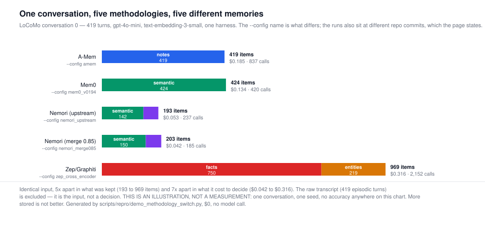

# Demo A — one conversation, five methodologies, one interface

> **This page is an illustration, not a measurement.** One conversation, one seed, and no accuracy
> number anywhere on it. The measurements live in [`docs/18-locomo-4way.md`](../18-locomo-4way.md)
> and [`docs/19-ace-finer.md`](../19-ace-finer.md), and they carry confidence intervals. **More
> stored is not better** — a system can keep 969 items and answer
> worse than one that kept 193. Nothing here is ranked.

Nine agentic-memory methodologies are implemented in this repository behind one API and selected by
name. What that buys is the ability to feed all of them the same input and *look*, instead of
arguing from papers. Below, five write paths over the same LoCoMo conversation — **419 turns,
`gpt-4o-mini`, `text-embedding-3-small`, one harness** — where the `--config` name is what differs
between the runs.

**Cost to produce this page: $0.** Nothing was ingested and no model was called. Every number is
read out of an ingest summary the campaign already paid for and committed.

```
uv run python scripts/repro/demo_methodology_switch.py
```



## What each one kept

These counts are the **derived** items — what the methodology decided to write. The raw transcript
(`episodic`) is excluded, following the harness's own convention, because it is the input rather
than a decision. Every arm's op log records 419 `ADD:episodic` operations for it.

| config | methodology | what it stored | items | write calls | embedding calls | cost |
|---|---|---|---|---|---|---|
| `amem` | A-Mem | 419 notes | 419 | 837 | 2,502 | $0.185 |
| `mem0_v0194` | Mem0 | 424 semantic | 424 | 420 | 1,480 | $0.134 |
| `nemori_upstream` | Nemori (upstream) | 142 semantic, 51 episodes | 193 | 237 | 714 | $0.053 |
| `nemori_merge085` | Nemori (merge 0.85) | 150 semantic, 53 episodes | 203 | 185 | 728 | $0.042 |
| `zep_cross_encoder` | Zep/Graphiti | 750 facts, 219 entities | 969 | 2,152 | 4,205 | $0.316 |

**5× apart in what was kept and 7× apart in what it cost to decide, on identical input.**
`nemori_upstream` kept 193 items for $0.053; `zep_cross_encoder` kept 969 for $0.316. They are not
doing better or worse jobs of the same task — they are doing different tasks, and that is the point
of keeping them separable rather than blending them into one "memory layer".

Embedding calls are listed apart from generative ones on purpose. They are priced three orders of
magnitude differently, and a single "LLM calls" column that silently merges them is how one of this
repository's own cost claims went wrong ([ledger C-entry on MemoryOS](../17-defect-ledger.md)).

### An inconsistency this page found, and the defect behind it

Every arm's op log records 419 `ADD:episodic` operations, but the raw transcript is present in only
3 of the 5 memory snapshots:

| config | `ADD:episodic` in the op log | `episodic` rows in the snapshot |
|---|---|---|
| `amem` | 419 | 419 |
| `mem0_v0194` | 419 | 419 |
| `nemori_upstream` | 419 | **0** |
| `nemori_merge085` | 419 | **0** |
| `zep_cross_encoder` | 419 | 419 |

The two arms missing it are exactly the two that override the doc store to `PostgresDocStore`
(`configs.NEMORI_STORE`) — and the cause turned out to be simple: **`PostgresDocStore` did not
implement `list_episodes` at all.** `SqliteDocStore` did, three call sites already used it, and the
`DocStore` protocol never declared it, so nothing forced the gap into the open. The snapshot writer
calls it through a `getattr` guard, so on the Postgres-backed arms it skipped the transcript **in
silence** — producing an artifact that looked complete and simply had no transcript in it.

The episodes were written; only the snapshot of them was not. Nothing on this page moves either way:
the counts above are derived items, which come from `list_items`, and the op log is the durable
record regardless.

Fixed rather than annotated: `list_episodes` is now part of the `DocStore` protocol with its
oldest-first contract stated, `PostgresDocStore` implements it, the writer's guard now logs a
warning instead of skipping quietly, and `tests/test_store_contract.py` fails if any backend is
missing a method its protocol declares. **The affected artifacts are NOT regenerated** — that would
mean re-running paid ingests to fill in a snapshot whose absence changed no measurement.

## The operations behind those counts

The op log is the durable record — every mutation is appended before it is applied — so the *verbs*
each methodology uses are recoverable, not inferred:

| config | ops |
|---|---|
| `amem` | `ADD:episodic` 419, `ADD:notes` 419, `LINK:notes` 417, `UPDATE:notes` 1,245 |
| `mem0_v0194` | `ADD:episodic` 419, `ADD:semantic` 449, `NOOP:semantic` 1,967, `UPDATE:semantic` 71, `DELETE:semantic` 25 |
| `nemori_upstream` | `ADD:episodic` 419, `ADD:episodes` 33, `ADD:semantic` 142, `MERGE:episodes` 18, `INVALIDATE:episodes` 18 |
| `nemori_merge085` | `ADD:episodic` 419, `ADD:episodes` 51, `ADD:semantic` 150, `MERGE:episodes` 2, `INVALIDATE:episodes` 2 |
| `zep_cross_encoder` | `ADD:episodic` 419, `ADD:entities` 219, `ADD:facts` 750, `UPDATE:facts` 302, `INVALIDATE:facts` 90, `UPDATE:entities` 92, `ADD:communities` 123 |

Read the verbs, not just the totals. `mem0_v0194` is the only arm here that **deletes**; Zep is the
only one that builds `entities` and `communities` alongside facts; the two Nemori arms differ *only*
in a merge threshold and that shows up as 18 merges against 2.

## Five shapes of the same subject matter

All five arms wrote about the support group Caroline attends in this conversation. Below is the
first item of each kind that mentions `support group`, in snapshot order, verbatim:

**A-Mem** — `--config amem`

> *notes* — (1:56 pm on 8 May, 2023) Caroline: The support group has made me feel accepted and given me courage to embrace myself.

**Mem0** — `--config mem0_v0194`

> *semantic* — Caroline went to a LGBTQ support group on 7 May, 2023

**Nemori (upstream)** — `--config nemori_upstream`

> *semantic* — {'date': '2023-05-07', 'event': 'Caroline attended an LGBTQ support group', 'description': 'The group focused on sharing transgender stories, which Caroline found powerful and inspiring.'}
>
> *episodes* — On June 27, 2023, at 10:37 AM, Melanie and Caroline engaged in a heartfelt conversation about personal growth and future aspirations. Melanie expressed her appreciation for family time and inquired about Caroline's recent endeavors. Caroline shared her interest in pursuing a career in counseling and mental health, motivated by her own experiences and the support she received. She revealed that she

**Nemori (merge 0.85)** — `--config nemori_merge085`

> *semantic* — {'date': 'May 7, 2023', 'event': 'Caroline attended an LGBTQ support group', 'impact': 'Caroline found the stories shared in the group powerful and inspiring.'}
>
> *episodes* — On May 8, 2023, at 1:56 PM, Caroline and Melanie greeted each other warmly during their conversation. Melanie shared that she was overwhelmed balancing her kids and work, while Caroline revealed her recent experience attending an LGBTQ support group the day before (May 7, 2023), describing it as powerful. Intrigued, Melanie asked about the impactful stories Caroline heard, to which Caroline expres

**Zep/Graphiti** — `--config zep_cross_encoder`

> *facts* — Caroline attended a LGBTQ support group.
>
> *entities* — support system: The network of people providing love and encouragement, similar to support groups.

**These are not five records of one event, and the page will not claim they are.** The filter is
topical, the pick is first-match-in-file-order, and the dates give it away — one arm's first
matching episode is from a different day than another's. Selecting harder until five sentences lined
up would mean choosing what looked good, which is worse than saying this plainly.

What the quotes do support is the claim they were assembled for: **these are different kinds of
object.** A turn kept whole; a natural-language sentence; a dict with a `date` field and, depending
on the arm, `description` or `impact`; a narrated multi-turn episode; a subject-predicate-object
fact; an entity with a gloss. That is the argument for pinning lineage instead of shipping one
blended "memory layer" — a benchmark number attached to "memory" without saying which of these was
built is not attached to anything.

## Provenance

| config | ingest summary | repo commit at run | ingest wall-clock |
|---|---|---|---|
| `amem` | `results/repro/gpt-4o-mini_conv0_ingest_e3s_c0.json` | `2becf90` | 53 min |
| `mem0_v0194` | `results/repro/gpt-4o-mini_mem0_v0194_conv0_ingest_e3sM_c0.json` | `4b8fb5b` | 31 min |
| `nemori_upstream` | `results/repro/gpt-4o-mini_nemori_upstream_conv0_ingest_e3sA_c0.json` | `ba683b1` | 15 min |
| `nemori_merge085` | `results/repro/gpt-4o-mini_nemori_merge085_conv0_ingest_e3sB_c0.json` | `4e8b7ed` | 12 min |
| `zep_cross_encoder` | `results/repro/gpt-4o-mini_zep_cross_encoder_conv0_ingest_e3sZ_c0.json` | `74c9528` | 87 min |

**The commits differ, and that is a real limitation of this page.** These arms were ingested on
different days as the campaign progressed, so this is not a controlled five-way comparison of one
codebase — it is five runs that shared a conversation, a model and an embedder. The controlled
comparison is [`docs/18-locomo-4way.md`](../18-locomo-4way.md), which is also where the accuracy
numbers and their intervals are.

**ACE is missing on purpose.** Its arm in this campaign runs on FiNER, a tagging benchmark, not on a
conversation; putting it in this table would compare what it stored about a different input. It has
its own page: [cost-is-tokens.md](cost-is-tokens.md).

Item counts and quoted text are read from each run's `*.memory.jsonl` snapshot, which is gitignored
for size (docs/14 §Artifacts). The derived index is committed as
`results/repro/demo_methodology_switch.snapshot.json` so this page regenerates from a fresh clone;
`--rescan` rebuilds it where the snapshots exist.
