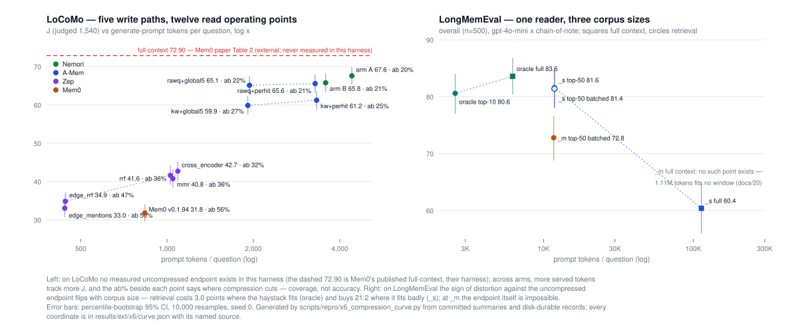

# 압축-왜곡 실측 곡선 (X6) — 이미 지불한 아티팩트의 재배열

2026-08-19. 확장 계층 X6 스트림의 산출물. rate-distortion 프레임(arXiv:2607.08032)을 **새 실험
없이** 이 레포가 이미 보유한 측정으로 실측점 곡선으로 만든다. 지출 $0 — 모든 좌표는 커밋된 run
summary, disk-durable records, 메모리 스냅샷, LLM 트레이스에서 로컬로 재계산했고, LLM·임베더
호출은 한 번도 없었다.

**모든 수치의 단일 출처는 [`results/ext/x6/curve.json`](../../results/ext/x6/curve.json)이며,
이 문서의 표는 전부 그 파일에서 옮겨 적은 것이다(손계산 0).** 그 파일을 쓰는
`scripts/repro/x6_compression_curve.py`는 fail-closed다: 각 arm의 J(LoCoMo) / overall(LME)를
records에서 재계산해 `docs/18-locomo-4way.md` · `docs/20-lme-reading.md`의 발표값과 소수 둘째
자리까지 대조하고, 하나라도 어긋나면 아무것도 쓰지 않는다. 이번 실행에서 18개 점 전부 일치했다.



## 1. 축의 정의 — 무엇이 측정이고 무엇이 유도인가

| 축 | 정의 | 출처 | 지위 |
|---|---|---|---|
| 압축 (1차) | 문항당 generate 프롬프트 토큰 | LoCoMo: 각 eval summary의 `llm_budget.generate.tokens_in / calls`. LME: records의 행별 `usage.generate.tokens_in` 평균 (summary는 프로세스 단위라 resume된 arm에서 과소계상 — docs/20 §의 실측 교훈을 그대로 반영한 선택) | **실측** (API가 청구한 토큰) |
| 압축 (보조) | store 항목 수 · 항목 평균 길이 · 스냅샷 바이트 | 각 arm이 실제로 읽은 store의 `memory.jsonl` + summary `memory_capacity`, 항목 수는 `stamp.memory_types`(그 arm이 서빙하는 타입)로 필터 | **실측** (스냅샷 전수 스캔; 스캔 행수 ≠ capacity면 스크립트가 중단) |
| 왜곡 | J (LoCoMo, judged 1,540) / overall (LME, 500) + 백분위 부트스트랩 95% CI (10,000 재표집, seed 0 — `scripts/ext/x1_power.py`가 고정한 관례) | records의 문항별 판정 | **실측** (재계산 + 발표값 앵커 대조) |
| 커버리지 분해 | abstention = pred에 "No information available" 포함 비율(judged 행), acc-when-answered ≡ J/(1−abstention) | records + `src/agmem/bench/locomo.py`의 ANSWER_PROMPT 계약 | abstention은 **실측**, acc는 **유도** — docs/18의 분해 표와 동일한 항등식이며, 기권하면서 정답 판정을 받은 소수 행(예: Mem0 7행)이 분자에 남는 것까지 동일 |

서빙 토큰을 1차 축으로 둔 이유: 이 곡선의 y값(점수)을 만드는 것은 reader에게 실제로 도달한
슬라이스이고, 그 슬라이스는 저장 압축(write)과 서빙 압축(read k·expansion)의 합성이다. 저장측
수치는 보조축으로 병기하되, 두 축이 갈라지는 지점(Mem0)이 §3의 관찰 그 자체다.

예외 1건: Zep `mmr`은 아티팩트 기록 중 프로세스가 죽어 summary가 없다(docs/18 † 각주). 그 arm의
토큰은 자신의 LLM 트레이스(generate 행 합산)에서 왔고 — 발표된 비용이 합산된 것과 같은 원천 —
store 수치는 같은 ingest를 읽는 `e3sZrrf` summary의 스냅샷을 인용한다(headline `e3sZ`의 스냅샷은
communities-roster 수정 이전 판이라 1,243행이 짧다, docs/18 ‡). 둘 다 curve.json의 per-point
`store_source` / `prompt_tokens_source`에 그대로 공시되어 있다.

## 2. LoCoMo — 12개 점, 한 하네스, 한 judge

전부 gpt-4o-mini 응답 · Mem0-J judge · `text-embedding-3-small`. J와 CI, 커버리지 분해, 서빙·저장
압축을 한 표에 놓는다.

| arm | J [95% CI] | 토큰/문항 | 기권률 | 답했을 때 정답률 | store 항목(서빙 타입) | 항목 평균 길이 | eval $ |
|---|---|---|---|---|---|---|---|
| Nemori arm A | **67.60** [65.26, 69.87] | 4,408.9 | 19.5% | 84.0% | 2,704 | 442.5자 | 1.371 |
| Nemori arm B | 65.78 [63.38, 68.18] | 3,573.5 | 20.6% | 82.9% | 2,530 | 379.5자 | 1.122 |
| A-Mem rawq+perhit | 65.58 [63.18, 67.92] | 3,283.2 | 21.0% | 83.0% | 5,882 | 159.3자 | 1.034 |
| A-Mem rawq+global5 | 65.13 [62.73, 67.47] | 1,937.2 | 21.6% | 83.0% | 5,882 | 159.3자 | 0.633 |
| A-Mem kw+perhit (headline) | 61.23 [58.77, 63.57] | 3,321.9 | 25.1% | 81.7% | 5,882 | 159.3자 | 1.090 |
| A-Mem kw+global5 | 59.87 [57.47, 62.27] | 1,912.6 | 26.9% | 82.0% | 5,882 | 159.3자 | 0.670 |
| Zep cross_encoder (§4.1) | 42.73 [40.26, 45.19] | 1,090.3 | 32.2% | 63.0% | 12,620 | 65.2자 | 0.380 |
| Zep rrf | 41.62 [39.16, 44.09] | 1,026.8 | 35.8% | 64.8% | 12,620 | 65.2자 | 0.361 |
| Zep mmr | 40.78 [38.31, 43.25] | 1,048.2 | 36.3% | 64.0% | 12,620 | 65.2자 | (트레이스 합산, docs/18 †) |
| Zep edge_rrf | 34.87 [32.53, 37.21] | 441.8 | 46.8% | 65.5% | 8,778 | 41.6자 | 0.187 |
| Zep edge_mentions | 33.05 [30.71, 35.39] | 439.9 | 49.9% | 65.9% | 8,778 | 41.6자 | 0.186 |
| Mem0 v0.1.94 | 31.82 [29.55, 34.16] | 836.5 | 55.6% | 71.7% | 5,427 | 46.0자 | 0.305 |

교차 확인이 되는 값들: 토큰/문항은 docs/18 read-path 표의 3,574–4,409 / 3,322 / 1,913 / 837과,
Zep 레시피 표의 1,090 / 1,027 / 1,048 / 442 / 440과 일치한다. 항목 평균 길이의 Mem0 46.0자는
docs/18이 발표한 "46.0 characters over all 5,427"의 독립 재계산이다. **Zep rrf·mmr·edge 계열의
기권률(35.8 / 36.3 / 46.8 / 49.9%)과 답변 정답률은 이 노트가 처음 계산한 값이다** — docs/18의
분해 표는 cross_encoder(32.2%)만 실었다.

### 관찰 1 — arm 간 점들은 곡선이되, 순수 압축 축이 아니다

12개 점을 통틀면 서빙 토큰이 큰 arm이 J도 높다(440토큰·33.05 ↔ 4,409토큰·67.60). 그러나 arm 간
비교는 write path와 read path가 **동시에** 다르므로(설계 문서 §X6의 한계 명시 그대로) 이 단조성은
보조 증거다. 1급 증거는 같은 store 안에서 축 하나만 움직인 점들이다:

- **A-Mem 2×2** (한 store, 4개 read 조합): global5→perhit은 토큰 +74~69%에 J +1.36(kw) /
  +0.45(rawq). 쿼리 축(kw→rawq)은 토큰이 거의 그대로인 채 +5.26 / +4.35. 두 이득 모두 기권률
  하락(26.9→21.0% 범위)으로 오고, 답변 정답률은 81.7~83.0%에서 평평하다.
- **Zep 5 레시피** (한 ingest, 5개 read): 440→1,090토큰을 따라 J 33.05→42.73 (+9.7pp). 이동
  전체가 기권률이다 — 49.9%→32.2%로 17.7pp 내려가는 동안 답변 정답률은 63.0~65.9%로 **사실상
  상수**다. facts만 서빙(440토큰)에서 3-서브그래프(1,090토큰)로 컨텍스트를 여는 것이 Zep 내부의
  압축 완화이고, 그 대가가 전부 커버리지로 지불된다.

### 관찰 2 — 압축이 깎는 것은 커버리지이지 정확도가 아니다

12개 점에서 기권률의 범위는 19.5%~55.6%(36.1pp)인데, 답변 정답률의 범위는 Zep을 제외하면
71.7%~84.0%(12.3pp), Zep 포함 63.0%~84.0%다. J = (1−기권률)×정답률 항등식 위에서 arm 간 격차의
주성분은 앞항이다. 극단 대비: Mem0는 답하면 71.7%로 A-Mem headline(81.7%)과 10.0pp 차이지만,
답하는 비율 자체가 44.4% 대 74.9%다. docs/18의 문장 — "More memories, less memory" — 를 이 표는
저장측 열로 정량화한다: Mem0는 Nemori arm A보다 **2.0배 많은 항목**(5,427 대 2,704)을 저장하고
최대 k=30을 서빙하면서, 항목이 46.0자 대 442.5자이기 때문에 reader에게는 1/5의 토큰(837 대
4,409)이 도달한다. 저장 항목 수와 J의 역상관은 신비가 아니라 단위 길이의 산수다.

Zep의 낮은 답변 정답률(63.0~65.9%)은 이 커버리지 서사의 예외로 표에 그대로 남는다 — docs/18이
서술한 "추상화가 서빙되는 유일한 arm"이라는 별도 축이며, 압축률로 환원되지 않는다.

### 관찰 3 — LoCoMo 곡선에는 무압축 극한점이 **없다**

그림의 대시 선 72.90은 **이 하네스의 측정이 아니다.** Mem0 논문(arXiv:2504.19413) Table 2의
Full-context 행 — 그들의 하네스·judge — 이며 2026-07-23에 원문 대조로 검증된 값이다. 이 레포는
LoCoMo full-context arm을 실행한 적이 없으므로, 곡선의 오른쪽 끝(압축 0)은 외부 발표치를 참조
선으로만 그리고 압축 좌표를 부여하지 않았다. 확장 계층의 경계 문서화 스트림(X4)이 이 지점을
"passthrough 재해석"으로 서술한다 — full-context가 모든 write-path arm 위에 있다는 사실을
컨텍스트 예산·비용 축과 함께 정면으로 다루는 것은 그 문서의 소관이고, 이 노트는 그 점이 곡선
위 어디에 놓이는지(그리고 우리 점이 아니라는 것)만 고정한다. 곡선의 **중간 구간** — passthrough
store(무압축 저장)에 검색 read를 얹은 지점 — 도 비어 있으며, 그 빈 구간이 X5(GAM-lite) 스케치의
동기다. 채우지 않고 비워둔다: 보간 금지.

## 3. LongMemEval — 같은 reader, 같은 500문항, 코퍼스만 3규모

전 arm gpt-4o-mini × chain-of-note, pinned judge `gpt-4o-2024-08-06`. 여기서 곡선의 의미가
LoCoMo와 다르다: LoCoMo 패널은 "무엇을 저장했는가"가 점들을 갈랐지만, 이 패널의 write path는
전부 passthrough(LLM 0콜)이고 움직인 것은 **코퍼스 크기와 서빙 방식**뿐이다.

| arm | overall [95% CI] | task-avg | 토큰/문항 | eval $ |
|---|---|---|---|---|
| oracle full (6.1K 하이스택) | 83.60 [80.40, 86.80] | 83.89 | 6,217.2 | 1.047 |
| oracle top-10 | 80.60 [77.00, 84.00] | 81.97 | 2,570.0 | 0.850 |
| `_s` full (114K) | 60.40 [56.00, 64.80] | 58.40 | 113,190.5 | 9.065 |
| `_s` top-50 | **81.60** [78.20, 85.00] | 80.81 | 11,828.0 | 2.621 |
| `_s` top-50 (batched) | 81.40 [78.00, 84.60] | 81.41 | 11,825.2 | 2.624 |
| `_m` top-50 (batched, 1.11M) | 72.80 [68.80, 76.60] | 72.56 | 11,700.7 | 4.615 |

paired 통계는 이 노트가 재계산하지 않고 커밋된 산출물을 인용한다(전부 같은 500문항 정렬, 부트
10,000 · seed 0):

- **oracle에서 검색은 세금이다**: full − top-10 = overall +3.00 [−0.40, +6.60] (full 우위,
  분리 안 됨) — `results/repro/lme_format_retrieval_paired.json`.
- **`_s`에서 같은 기계가 +21.20을 산다**: top-50 − full = +21.20 [+16.60, +25.60], McNemar
  132/26, p<1e-16 — `results/repro/lme_s_paired.json`.
- **`_s`→`_m` (10배 코퍼스, read path 동일)**: +8.60 [+5.00, +12.20], p=9e-06 —
  `results/repro/lme_m_paired.json`. batched끼리의 비교(임베딩 수치 레짐 통제,
  `results/repro/lme_embed_jitter_paired.json`이 그 레짐 차이가 +0.20 [−2.20, +2.60]임을 실측).

**"무압축 대비 왜곡"의 부호가 코퍼스 길이에 따라 뒤집힌다.** rate-distortion 프레임은 "전부
서빙"을 왜곡 0의 기준점으로 놓지만, 이 데이터에서 그 기준점 자체가 코퍼스가 길수록 열화한다
(oracle 83.60 → `_s` full 60.40 — 창에 **들어가는** 하이스택인데도 −23.2). 그래서 6.1K에서는
압축(top-10)이 3.0pp의 왜곡이고, 114K에서는 압축(top-50)이 **−21.2pp의 왜곡, 즉 이득**이다.
1.11M(`_m`)에서는 기준점이 아예 존재할 수 없다 — 중앙값 인스턴스가 128K 창의 8.8배라 full-context
arm은 실행 불가능하며, 이것은 측정의 공백이 아니라 **그 좌표에 점이 존재할 수 없다는 실측 사실**
이다(docs/20). 남는 정밀한 서술은 docs/20의 것이다: 검색은 어떤 창에도 안 들어가는 코퍼스를
읽을 수 있게 만들지만, 그 점수는 코퍼스 크기에 상수가 아니다(10배에 −8.60pp).

두 벤치는 곡선으로 합치지 않는다. 벤치·judge·질문 구조가 다르고, LoCoMo 패널은 write-path 축,
LME 패널은 코퍼스-길이 축이 지배 변수다. 한 그림의 두 패널로 병치만 한다.

## 4. 한계

1. **arm 간 점은 합성 축이다** — LoCoMo 패널의 arm 간 비교는 write와 read가 동시에 움직인다.
   순수한 축 이동은 §2 관찰 1의 within-store 점들뿐이며, 이 서열은 설계 문서(§X6)가 지정한
   증거 등급 그대로다.
2. **단일 seed.** 어떤 점도 seed 반복이 없다(Track 1의 ±0.35pp per-arm 안정성 실측이 유일한
   앵커). LoCoMo 상위 3점의 순위는 이 CI 폭에서 겹친다 — 인접쌍 분리 판정은
   [`locomo-gold-audit-replay.md`](locomo-gold-audit-replay.md)가 정본이고(arm A−B p=0.097,
   분리 안 됨), 이 곡선에서 순위를 읽지 말 것.
3. **gold 오류.** 외부 감사가 지목한 99문항을 제외하면 LoCoMo 전 arm이 +1.07~2.68pp 오르고
   순위는 불변(같은 문서). 이 곡선의 y값은 발표 관례(1,540 분모)를 따른다.
4. **LME 왜곡의 기준점 문제**(§3)는 한계이자 발견이다: "무압축 = 왜곡 0"이라는 프레임의 가정이
   이 벤치에서 실측으로 깨진다.
5. 기권률 검출은 프롬프트 계약 문자열의 포함 매칭이다. 완곡한 비-기권 무응답("I cannot
   determine...")은 기권으로 세지 않으며, 이는 docs/18의 분해와 같은 규칙이다.

## 5. 재현

```bash
uv run python scripts/repro/x6_compression_curve.py
# → results/ext/x6/curve.json + docs/research/assets/x6-compression-curve.svg
# 결정론(seed 0). 어떤 재계산 점이든 docs/18·docs/20 발표값과 어긋나면 아무것도 쓰지 않는다.
```

읽는 아티팩트 (전부 기존, 이 스트림이 생성한 것 없음):

| 입력 | 좌표 |
|---|---|
| `results/repro/<stem>.records.jsonl` (LoCoMo 12벌 + LME 6벌) | J/overall · CI · 기권률 (LME는 토큰/문항도) |
| `results/repro/<stem>.json` (eval summary, 커밋본) | LoCoMo 토큰/문항 (`llm_budget.generate`), eval $ |
| `results/repro/<stem>.memory.jsonl` + summary `memory_capacity`·`stamp.memory_types` | store 항목 수·평균 길이·바이트 |
| `results/repro/gpt-4o-mini_zep_mmr_..._e3sZmmr.llm-trace.jsonl` | mmr 토큰/문항 (summary 부재 대체, docs/18 †) |
| `results/repro/lme_{s,m,format_retrieval,embed_jitter}_paired.json` | §3의 paired Δ·CI (인용, 재계산 아님) |

LoCoMo 12벌의 stem 전체 목록과 점별 출처 필드는 `results/ext/x6/curve.json`의
`prompt_tokens_source` / `store_source` / `records`에 있다. records·memory.jsonl·trace는
gitignore 정책상 disk-durable(git 미추적)이고 summary·paired json은 커밋본이다 — X1과 같은 입력
지위다.
